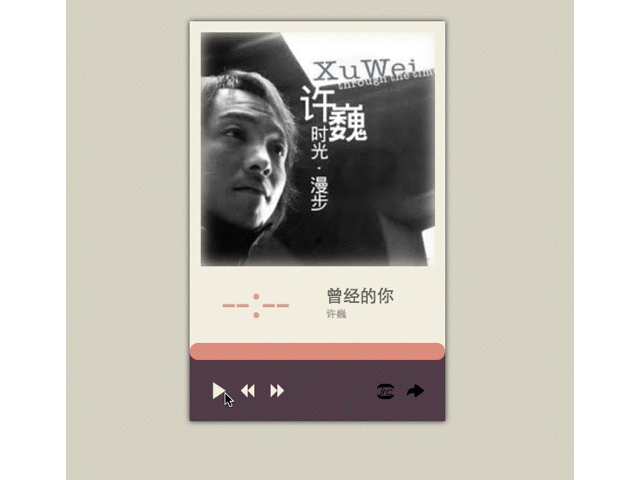

# `my_music_player`

 
> ####简介
自己的第一个网页播放器编写，主要练习jQuery的使用，和CSS3的部分新特性。
播放器的页面经历过两次重大的修改，终于从一个丑陋不堪的样子，变成现在还看的过去。
播放器会继续更新，不断添加新的功能。

###工具
`jQuery`  `CSS3`  `HTML`
 
###功能
基本实现了常用功能，比如**播放**、**暂停**、**上一首**、**下一首**、**进度条**、**时间显示**等。